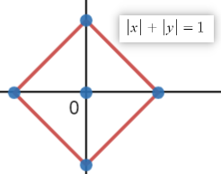
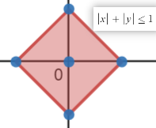
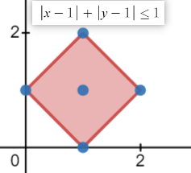

## 打印菱形————坐标系区域内的整点

[题目链接](https://www.acwing.com/problem/content/description/729/)

### 题目描述

输入一个奇数 n，输出一个由 `*` 构成的 n 阶实心菱形。

#### 样例

```
5
```

#### 输出

```
  *  
 *** 
*****
 *** 
  * 
```

---

以 $n = 3$ 为例，观察可得，菱形的边界类似与曲线 $|x|+|y|=1$，如下图所示



于是，要打印 `*` 的点为区域 $|x|+|y|≤1$ 内的整数点，如图



讲区域进行平移，中心坐标为$(1,1)$, 得 $|x-1|+|y-1|≤1$



对于一般情况，中心坐标为$([\frac{n}{2}],[\frac{n}{2}])$

转化为代码的判断条件即为 `if (abs(j - x) + abs(i - y) <= n / 2)`

据此便可得出代码

```c++
#include <iostream>
#include <cstdio>

using namespace std;

int main()
{
    int n; cin >> n;

    for (int i = 0, x = n / 2, y = n / 2; i < n; i++) {
        for (int j = 0; j < n; j++) {
            if (abs(x - i) + abs(y - j) <= n / 2) cout << '*';
            else cout << ' ';
        }
        cout << endl;
    }
    cout << endl;

    return 0;
}
```

类似的如果不打印边界, 将等于号去掉 `if (abs(j - x) + abs(i - y) < n / 2)`

```

  *
 ***
  *

```

如果要打印空心, 只需满足边界条件 `if (abs(j - x) + abs(i - y) == n / 2)`

```
  *
 * *
*   *
 * *
  *
```

以下图形类似

```c++
*********
**** ****
***   ***
**     **
*       *
**     **
***   ***
**** ****
*********
if (abs(x - i) + abs(y - j) >= n / 2)
```

```cpp
**** ****
***   ***
**     **
*       *

*       *
**     **
***   ***
**** ****
if (abs(x - i) + abs(y - j) > n / 2)
```

还有y总视频里有人提出的如下图形

```c++
*****
 ***
  *
 ***
*****
```

其对应的边界曲线为 $y^2=x^2$, 区域为 $y^2≥x^2$

那么打印条件为 `if ((j - x) * (j - x) <= (i - y) * (i - y)) `

类似的改变等号可以得到如下图形

```c++
*   *
** **
*****
** **
*   *
if ((j - x) * (j - x) >= (i - y) * (i - y))
```

```c++
*   *
 * *
  *
 * *
*   *
if ((j - x) * (j - x) == (i - y) * (i - y))
```

还可以玩一下抛物线

```cpp
if ( 0.05 * (j - x) * (j - x) > (i - y) ) cout << '*';
**************************************************
**************************************************
**************************************************
**************************************************
**************************************************
**************************************************
**************************************************
**************************************************
**************************************************
**************************************************
**************************************************
**************************************************
**************************************************
**************************************************
**************************************************
**************************************************
**************************************************
**************************************************
**************************************************
**************************************************
**************************************************
**************************************************
**************************************************
**************************************************
**************************************************
************************* ************************
*********************         ********************
*******************             ******************
******************               *****************
*****************                 ****************
***************                     **************
***************                     **************
**************                       *************
*************                         ************
************                           ***********
***********                             **********
***********                             **********
**********                               *********
*********                                 ********
*********                                 ********
********                                   *******
********                                   *******
*******                                     ******
*******                                     ******
******                                       *****
*****                                         ****
*****                                         ****
*****                                         ****
****                                           ***
****                                           ***
```

---

$$
END
$$

---
