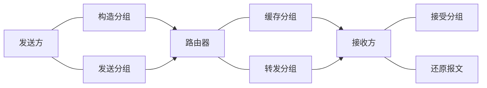

| internet         | 对比 | Internet     |
| :--------------- | :--- | :----------- |
| 通用名词         |      | 专用名词     |
| 互连网（互联网） |      | 因特网       |
| 任意通信协议     |      | TCP/IP协议族 |

| 优点                                                               | 缺点                                                                   |
| :----------------------------------------------------------------- | :--------------------------------------------------------------------- |
| 没有建立连接和释放连接的过程。                                     | 分组首部带来了额外的传输开销。                                         |
| 分组传输过程中逐段占用通信链路，有较高的通信线路利用率。           | 交换节点存储转发分组会造成一定的时延。                                 |
| 交换节点可以为每一个分组独立选择转发路由，使得网络有很好的生存性。 | 无法确保通信时端到端通信资源全部可用，在通信量较大时可能造成网络拥塞。 |
|                                                                    | 分组可能会出现失序和丢失等问题                                         |

$$发送时延 = \frac{分组长度(b)}{发送速率(b/s)}$$

$$发送速率 = min [主机接口速率，线路带宽，交换机或路由器的接口速率]$$

| | |
| :------- | :------------ |
| 自由空间 | 3.0 × 108 m/s |
| 铜 线    | 2.3 × 108 m/s |
| 光 纤    | 2.0 × 108 m/s |

