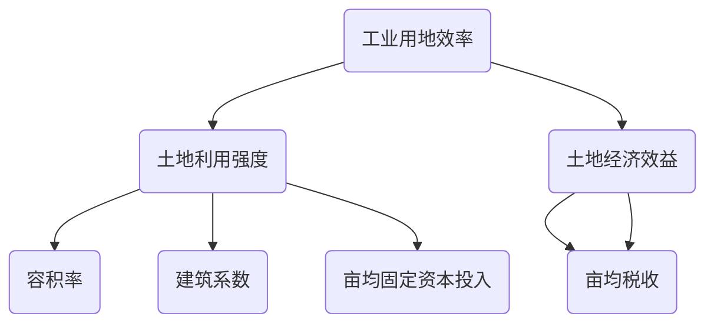
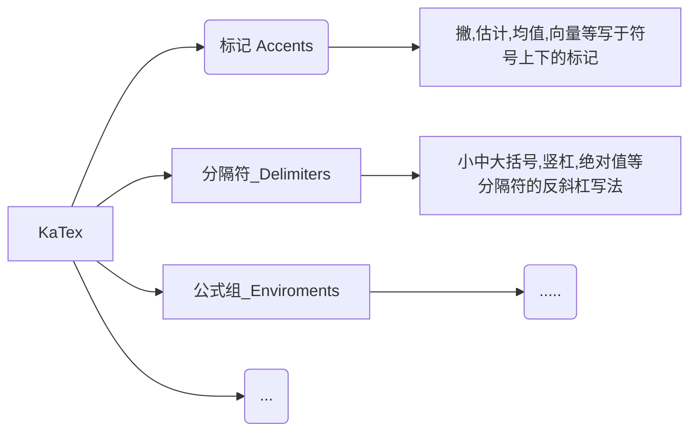
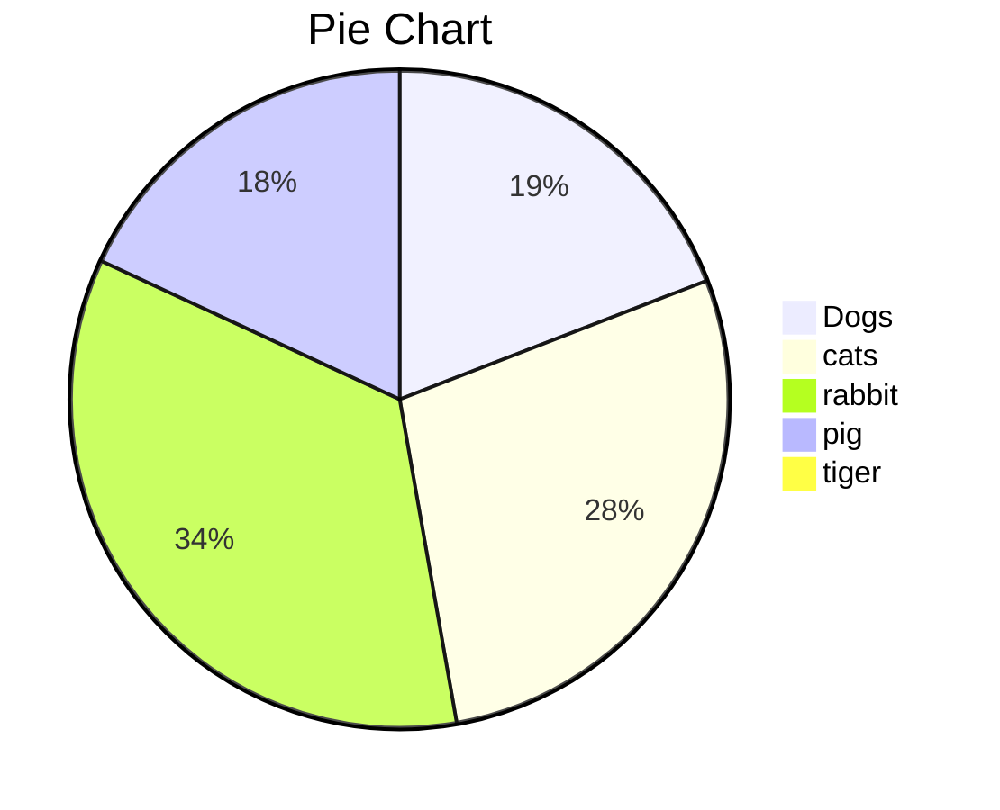
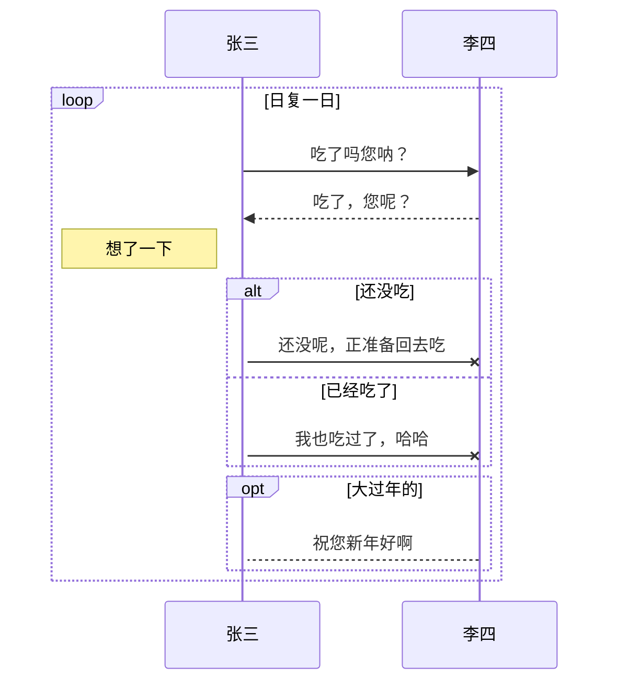
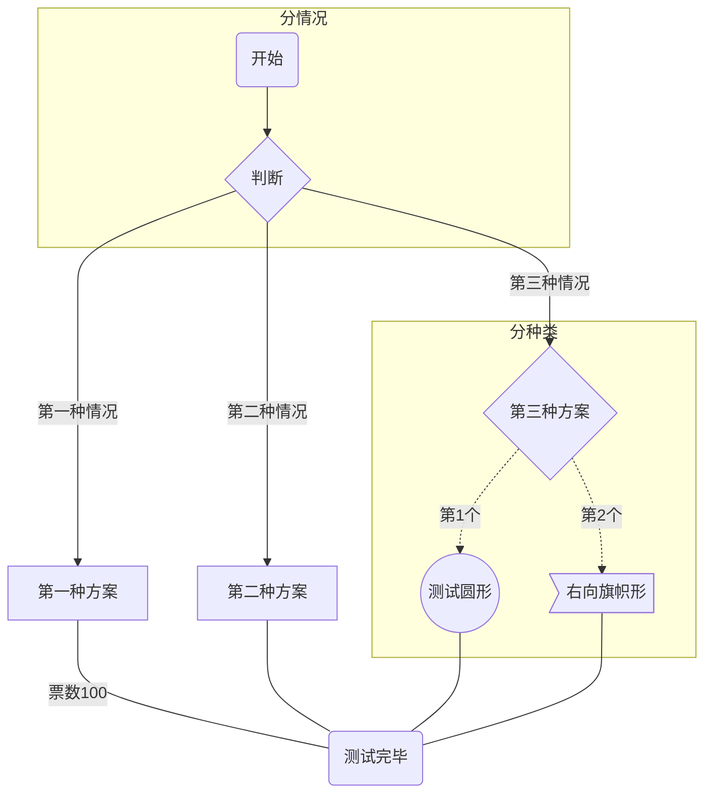
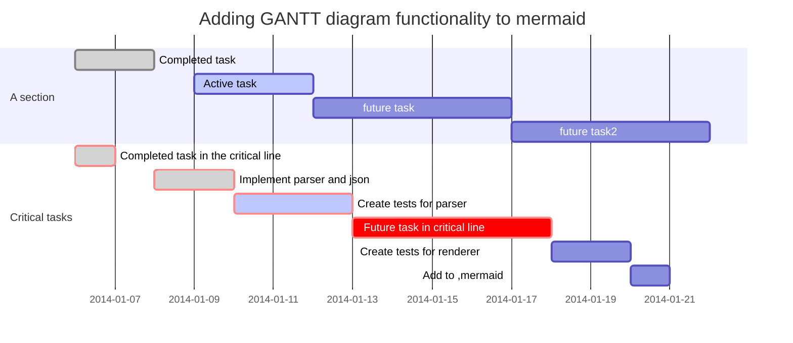
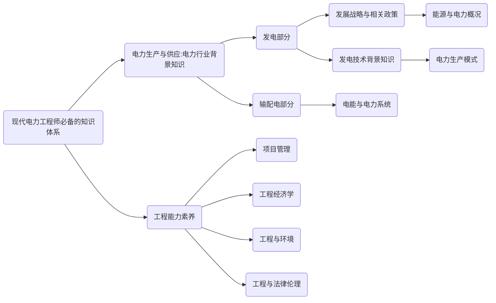

[toc]
# **syntax**
**Markdown是一种轻量级的「标记语言」**
<!-- vscode-markdown-toc -->
* 1. [MdEditor是一个在线编辑Markdown文档的编辑器](#MdEditorMarkdown)
* 2. [MdEditor的功能列表演示](#MdEditor)
* 3. [标题H2](#H2)
	* 3.1. [标题H3](#H3)
		* 3.1.1. [标题H4](#H4)
	* 3.2. [字符效果和横线等](#)
	* 3.3. [引用 Blockquotes](#Blockquotes)
	* 3.4. [锚点与链接 Links](#Links)
	* 3.5. [多语言代码高亮 Codes](#Codes)
		* 3.5.1. [行内代码 Inline code](#Inlinecode)
		* 3.5.2. [缩进风格](#-1)
		* 3.5.3. [JS代码](#JS)
		* 3.5.4. [HTML代码 HTML codes](#HTMLHTMLcodes)
	* 3.6. [图片 Images](#Images)
	* 3.7. [列表 Lists](#Lists)
		* 3.7.1. [无序列表（减号）Unordered Lists (-)](#UnorderedLists-)
		* 3.7.2. [无序列表（星号）Unordered Lists (*)](#UnorderedLists)
		* 3.7.3. [无序列表（加号和嵌套）Unordered Lists (+)](#UnorderedLists-1)
		* 3.7.4. [有序列表 Ordered Lists (-)](#OrderedLists-)
		* 3.7.5. [GFM task list](#GFMtasklist)
	* 3.8. [绘制表格 Tables](#Tables)
		* 3.8.1. [特殊符号 HTML Entities Codes](#HTMLEntitiesCodes)
	* 3.9. [Emoji表情 :smiley:](#Emoji:smiley:)
		* 3.9.1. [GFM task lists & Emoji & fontAwesome icon emoji & editormd logo emoji :editormd-logo-5x:](#GFMtasklistsEmojifontAwesomeiconemojieditormdlogoemoji:editormd-logo-5x:)
		* 3.9.2. [反斜杠 Escape](#Escape)
	* 3.10. [科学公式 TeX(KaTeX)](#TeXKaTeX)
	* 3.11. [绘制流程图 Flowchart](#Flowchart)
	* 3.12. [绘制序列图 Sequence Diagram](#SequenceDiagram)
	* 3.13. [绘制思维导图](#-1)
		* 3.13.1. [竖向](#-1)
		* 3.13.2. [横向](#-1)
	* 3.14. [[Mermaid 实用教程](https://blog.csdn.net/fenghuizhidao/article/details/79440583)](#Mermaidhttps:blog.csdn.netfenghuizhidaoarticledetails79440583)
	* 3.15. [End](#End)

<!-- vscode-markdown-toc-config
	numbering=true
	autoSave=true
	/vscode-markdown-toc-config -->
<!-- /vscode-markdown-toc -->


Markdown是一种可以使用普通文本编辑器编写的标记语言，通过简单的标记语法，它可以使普通文本内容具有一定的格式。它允许人们使用易读易写的纯文本格式编写文档，然后转换成格式丰富的HTML页面，Markdown文件的后缀名便是“.md”


##  1. <a name='MdEditorMarkdown'></a>MdEditor是一个在线编辑Markdown文档的编辑器

*MdEditor扩展了Markdown的功能（如表格、脚注、内嵌HTML等等），以使让Markdown转换成更多的格式，和更丰富的展示效果，这些功能原初的Markdown尚不具备。*

> Markdown增强版中比较有名的有Markdown Extra、MultiMarkdown、 Maruku等。这些衍生版本要么基于工具，如~~Pandoc~~，Pandao；要么基于网站，如GitHub和Wikipedia，在语法上基本兼容，但在一些语法和渲染效果上有改动。

MdEditor源于Pandao的JavaScript开源项目，开源地址[Editor.md](https://github.com/pandao/editor.md "Editor.md")，并在MIT开源协议的许可范围内进行了优化，以适应广大用户群体的需求。向优秀的markdown开源编辑器原作者Pandao致敬。


##  2. <a name='MdEditor'></a>MdEditor的功能列表演示

# 标题H1

##  3. <a name='H2'></a>标题H2

###  3.1. <a name='H3'></a>标题H3

####  3.1.1. <a name='H4'></a>标题H4

##### 标题H5

###### 标题H5

###  3.2. <a name=''></a>字符效果和横线等

----

~~删除线~~ <s>删除线（开启识别HTML标签时）</s>
*斜体字*      _斜体字_
**粗体**  __粗体__
***粗斜体*** ___粗斜体___

上标：X<sub>2</sub>，下标：O<sup>2</sup>

**缩写(同HTML的abbr标签)**

> 即更长的单词或短语的缩写形式，前提是开启识别HTML标签时，已默认开启

The <abbr title="Hyper Text Markup Language">HTML</abbr> specification is maintained by the <abbr title="World Wide Web Consortium">W3C</abbr>.

###  3.3. <a name='Blockquotes'></a>引用 Blockquotes

> 引用文本 Blockquotes

引用的行内混合 Blockquotes
                    
> 引用：如果想要插入空白换行`即<br />标签`，在插入处先键入两个以上的空格然后回车即可，[普通链接](http://localhost/)。

###  3.4. <a name='Links'></a>锚点与链接 Links

[普通链接](http://localhost/)

[普通链接带标题](http://localhost/ "普通链接带标题")

直接链接：<https://github.com>

[锚点链接][anchor-id] 

[anchor-id]: http://www.this-anchor-link.com/

GFM a-tail link @pandao

> @pandao

###  3.5. <a name='Codes'></a>多语言代码高亮 Codes

####  3.5.1. <a name='Inlinecode'></a>行内代码 Inline code

执行命令：`npm install marked`

####  3.5.2. <a name='-1'></a>缩进风格

即缩进四个空格，也做为实现类似`<pre>`预格式化文本(Preformatted Text)的功能。

    <?php
        echo "Hello world!";
    ?>

预格式化文本：

    | First Header  | Second Header |
    | ------------- | ------------- |
    | Content Cell  | Content Cell  |
    | Content Cell  | Content Cell  |

####  3.5.3. <a name='JS'></a>JS代码　

```javascript
function test(){
	console.log("Hello world!");
}
 
(function(){
    var box = function(){
        return box.fn.init();
    };

    box.prototype = box.fn = {
        init : function(){
            console.log('box.init()');

			return this;
        },

		add : function(str){
			alert("add", str);

			return this;
		},

		remove : function(str){
			alert("remove", str);

			return this;
		}
    };
    
    box.fn.init.prototype = box.fn;
    
    window.box =box;
})();

var testBox = box();
testBox.add("jQuery").remove("jQuery");
```

####  3.5.4. <a name='HTMLHTMLcodes'></a>HTML代码 HTML codes

```html
<!DOCTYPE html>
<html>
    <head>
        <mate charest="utf-8" />
        <title>Hello world!</title>
    </head>
    <body>
        <h1>Hello world!</h1>
    </body>
</html>
```

###  3.6. <a name='Images'></a>图片 Images

Image:


> Follow your heart.


> 图为：厦门白城沙滩

图片加链接 (Image + Link)：

[](https://www.mdeditor.cn/examples/images/7.jpg "李健首张专辑《似水流年》封面")

> 图为：李健首张专辑《似水流年》封面

----

###  3.7. <a name='Lists'></a>列表 Lists

####  3.7.1. <a name='UnorderedLists-'></a>无序列表（减号）Unordered Lists (-)

- 列表一
- 列表二
- 列表三
  
####  3.7.2. <a name='UnorderedLists'></a>无序列表（星号）Unordered Lists (*)

* 列表一
* 列表二
* 列表三

####  3.7.3. <a name='UnorderedLists-1'></a>无序列表（加号和嵌套）Unordered Lists (+)

+ 列表一
+ 列表二
    + 列表二-1
    + 列表二-2
    + 列表二-3
+ 列表三
    * 列表一
    * 列表二
    * 列表三

####  3.7.4. <a name='OrderedLists-'></a>有序列表 Ordered Lists (-)

1. 第一行
2. 第二行
3. 第三行

####  3.7.5. <a name='GFMtasklist'></a>GFM task list
- [ ]
- [ ] GFM task list 1
- [ ] GFM task list 2
- [ ] GFM task list 3
    - [ ] GFM task list 3-1
    - [ ] GFM task list 3-2
    - [ ] GFM task list 3-3
- [ ] GFM task list 4
    - [ ] GFM task list 4-1
    - [ ] GFM task list 4-2
                
----

###  3.8. <a name='Tables'></a>绘制表格 Tables

| 项目        | 价格   |  数量  |
| --------   | -----:  | :----:  |
| 计算机      | $1600   |   5     |
| 手机        |   $12   |   12   |
| 管线        |    $1    |  234  |

First Header  | Second Header
------------- | -------------
Content Cell  | Content Cell
Content Cell  | Content Cell

| First Header  | Second Header |
| ------------- | ------------- |
| Content Cell  | Content Cell  |
| Content Cell  | Content Cell  |

| Function name | Description                    |
| ------------- | ------------------------------ |
| `help()`      | Display the help window.       |
| `destroy()`   | **Destroy your computer!**     |

| Left-Aligned  | Center Aligned  | Right Aligned |
| :------------ |:---------------:| -----:|
| col 3 is      | some wordy text | $1600 |
| col 2 is      | centered        |   $12 |
| zebra stripes | are neat        |    $1 |

| Item      | Value |
| --------- | -----:|
| Computer  | $1600 |
| Phone     |   $12 |
| Pipe      |    $1 |

----

####  3.8.1. <a name='HTMLEntitiesCodes'></a>特殊符号 HTML Entities Codes

&copy; &  &uml; &trade; &iexcl; &pound;
&amp; &lt; &gt; &yen; &euro; &reg; &plusmn; &para; &sect; &brvbar; &macr; &laquo; &middot; 

X&sup2; Y&sup3; &frac34; &frac14;  &times;  &divide;   &raquo;

18&ordm;C  &quot;  &apos;

###  3.9. <a name='Emoji:smiley:'></a>Emoji表情 :smiley:

> Blockquotes :star:

####  3.9.1. <a name='GFMtasklistsEmojifontAwesomeiconemojieditormdlogoemoji:editormd-logo-5x:'></a>GFM task lists & Emoji & fontAwesome icon emoji & editormd logo emoji :editormd-logo-5x:

- [x] :smiley: @mentions, :smiley: #refs, [links](), **formatting**, and <del>tags</del> supported :editormd-logo:;
- [x] list syntax required (any unordered or ordered list supported) :editormd-logo-3x:;
- [x] [ ] :smiley: this is a complete item :smiley:;
- [x] []this is an incomplete item [test link](#) :fa-star: @pandao; 
- [ ] [ ]this is an incomplete item :fa-star: :fa-gear:;
    - [ ] :smiley: this is an incomplete item [test link](#) :fa-star: :fa-gear:;
    - [ ] :smiley: this is  :fa-star: :fa-gear: an incomplete item [test link](#);

####  3.9.2. <a name='Escape'></a>反斜杠 Escape

\*literal asterisks\*
            
###  3.10. <a name='TeXKaTeX'></a>科学公式 TeX(KaTeX)

$$E=mc^2$$

行内的公式$$E=mc^2$$行内的公式，行内的$$E=mc^2$$公式。

$$\(\sqrt{3x-1}+(1+x)^2\)$$
                    
$$\sin(\alpha)^{\theta}=\sum_{i=0}^{n}(x^i + \cos(f))$$

多行公式：

```math
\displaystyle
\left( \sum\_{k=1}^n a\_k b\_k \right)^2
\leq
\left( \sum\_{k=1}^n a\_k^2 \right)
\left( \sum\_{k=1}^n b\_k^2 \right)
```

```katex
\displaystyle 
    \frac{1}{
        \Bigl(\sqrt{\phi \sqrt{5}}-\phi\Bigr) e^{
        \frac25 \pi}} = 1+\frac{e^{-2\pi}} {1+\frac{e^{-4\pi}} {
        1+\frac{e^{-6\pi}}
        {1+\frac{e^{-8\pi}}
         {1+\cdots} }
        } 
    }
```

```latex
f(x) = \int_{-\infty}^\infty
    \hat f(\xi)\,e^{2 \pi i \xi x}
    \,d\xi
```

###  3.11. <a name='Flowchart'></a>绘制流程图 Flowchart

```flow
st=>start: 用户登陆
op=>operation: 登陆操作
cond=>condition: 登陆成功 Yes or No?
e=>end: 进入后台

st->op->cond
cond(yes)->e
cond(no)->op
```

###  3.12. <a name='SequenceDiagram'></a>绘制序列图 Sequence Diagram

```seq
Andrew->China: Says Hello 
Note right of China: China thinks\nabout it 
China-->Andrew: How are you? 
Andrew->>China: I am good thanks!
```
###  3.13. <a name='-1'></a>绘制思维导图
**Example**
####  3.13.1. <a name='-1'></a>竖向

####  3.13.2. <a name='-1'></a>横向

###  3.14. <a name='Mermaidhttps:blog.csdn.netfenghuizhidaoarticledetails79440583'></a>[Mermaid 实用教程](https://blog.csdn.net/fenghuizhidao/article/details/79440583)、[总结-Mermaid流程图教程(翻译)](https://blog.csdn.net/u011412840/article/details/113797801?spm=1001.2101.3001.6650.1&utm_medium=distribute.pc_relevant.none-task-blog-2%7Edefault%7ECTRLIST%7ERate-1.pc_relevant_paycolumn_v3&depth_1-utm_source=distribute.pc_relevant.none-task-blog-2%7Edefault%7ECTRLIST%7ERate-1.pc_relevant_paycolumn_v3&utm_relevant_index=2)、[markdown - 画图](https://blog.csdn.net/lis_12/article/details/80693975)、[markdown绘图插件----mermaid简介](https://www.cnblogs.com/wuyida/p/6301240.html)、[MarkDown画图(实例讲解) —— 流程图、序列图、饼图、甘特图](https://www.jianshu.com/p/77cc07f47cdc)、[Mermaid从入门到入土——Markdown进阶语法](https://zhuanlan.zhihu.com/p/355997933)、[Markdown图表语法](https://www.jianshu.com/p/9810ba886955)
###  3.15. <a name='End'></a>End


```echart    
,预算,收入,花费,债务          # 前面逗号不能省
June,5000,8000,4000,6000
July,3000,1000,4000,3000
Aug,5000,7000,6000,3000
Sep,7000,2000,3000,1000
Oct,6000,5000,4000,2000
Nov,4000,3000,5000,

type: column
title:每月收益
x.title: Amount
y.title: Month
y.prefix: $                     #  后缀是：y.suffix: $
```

```math
e^{i\pi} + 1 = 0
```

```echarts

 "title" : {  
 "text": "简单的折线图",  
 "subtext": "纯属虚构"  
 },  
 "tooltip" : {  
 "trigger": "axis"  
 },  
 "toolbox": {  
 "show" : true,  
 "feature" : {  
 "mark" : {"show": true},  
 "dataView" : {"show": true, "readOnly": false},  
 "magicType" : {"show": true, "type": ["line", "bar"]},  
 "restore" : {"show": true},  
 "saveAsImage" : {"show": true}  
 }  
 },  
 "calculable" : true,  
    "xAxis": {
        "type": "category",
            "data": ["Mon", "Tue", "Wed", "Thu", "Fri", "Sat", "Sun"]
    },
    "yAxis": {
        "type": "value"
    },
    "series": [{
        "data": [820, 932, 901, 934, 1290, 1330, 1320],
        "type": "line"
    }]
    
```

```echarts


```
<font face="黑体">我是黑体字
我是黑体字
我是黑体字
</font>
<font face="微软雅黑">我是微软雅黑
我是微软雅黑
我是微软雅黑
</font>
<font face="STCAIYUN">我是华文彩云
我是华文彩云
我是华文彩云
</font>



## [**markdown 教程（目录）**](https://qiankunpingtai.cn/article/1556607461225?p=1&m=0)


[ECharts初体验（下载使用步骤、vscode取色器插件）](https://blog.csdn.net/qq_40486952/article/details/106016253)

[使用vscode 中的 markdown preview enhanced 加载echart画图](https://blog.csdn.net/u014749905/article/details/104720681?ops_request_misc=%257B%2522request%255Fid%2522%253A%2522164630373416780261990079%2522%252C%2522scm%2522%253A%252220140713.130102334..%2522%257D&request_id=164630373416780261990079&biz_id=0&utm_medium=distribute.pc_search_result.none-task-blog-2~all~baidu_landing_v2~default-6-104720681.pc_search_result_control_group&utm_term=VScode+Echarts&spm=1018.2226.3001.4187)

```mermaid
gantt
 dateFormat  YYYY-MM-DD
 title     软件开发任务进度安排 
 excludes   weekends
​
 section 软硬件选型 
 硬件选择      :done,desc1, 2020-01-01,6w 
 软件设计      :active,desc2, after desc1,3w

 section 编码准备
 软件选择       :crit,done,desc3,2020-01-01,2020-01-29
 编码和测试软件   :1w
 安装测试系统    :2020-02-12,1w

 section 完成论文
 编写手册      :desc5,2020-01-01,10w
 论文修改      :crit,after desc3,3w
 论文定稿      :after desc5,3w
```





```echarts

```




<!DOCTYPE html>
<html>
<head>
    <meta charset="utf-8">
    <title>第一个 ECharts 实例</title>
    <!-- 引入 echarts.js -->
    <script src="https://cdn.staticfile.org/echarts/4.3.0/echarts.min.js"></script>
</head>
<body>
    <!-- 为ECharts准备一个具备大小（宽高）的Dom -->
    <div id="main" style="width: 600px;height:400px;"></div>
    <script type="text/javascript">
        // 基于准备好的dom，初始化echarts实例
        var myChart = echarts.init(document.getElementById('main'));
 
        // 指定图表的配置项和数据
        var option = {
            title: {
                text: '第一个 ECharts 实例'
            },
            tooltip: {},
            legend: {
                data:['销量']
            },
            xAxis: {
                data: ["衬衫","羊毛衫","雪纺衫","裤子","高跟鞋","袜子"]
            },
            yAxis: {},
            series: [{
                name: '销量',
                type: 'bar',
                data: [5, 20, 36, 10, 10, 20]
            }]
        };
 
        // 使用刚指定的配置项和数据显示图表。
        myChart.setOption(option);
    </script>
</body>
</html>